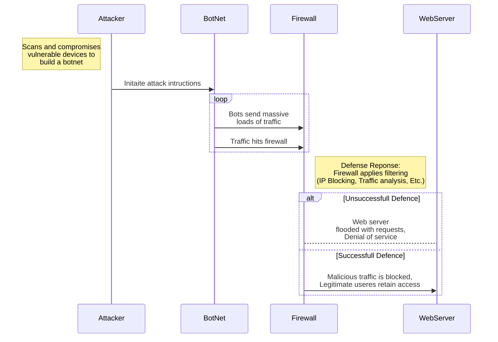

# Explination of Events
   1. The attacker will identify the target webserver and will begin to scan for compromises and vulnerabilities. They will build a botnet specificly for the target webserver
   2. After the attacker has built the botnet, they will send intructions to it to start sending massive loads of traffic to the targeted webserver.
   3. Before the traffic gets to the webserver it has to go through the firewall. The firewall will filter through the traffic coming through and will determine what can pass through it.
      *  At first the firewall will attempt initial filtering, which includes IP blocking, traffic analysis, and rate limiting.
      *  The firewall might flag suspicious activity and do future analysis.
      *  The firewall can also be overwhelmed and allow some traffic through it.
   4. If the traffic makes it through the firewall and makes it to the webserver then the webserver will be flooded with requests causing slow response or total outage
      * If the firewall was successful in blocking all the malicious traffic then there is no distruption of service for legitimate users.
  
